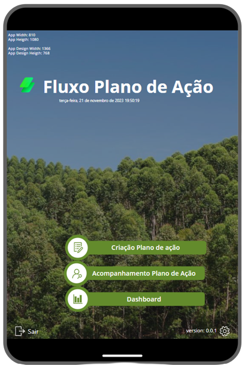
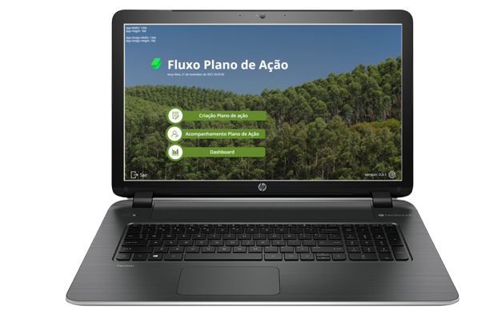
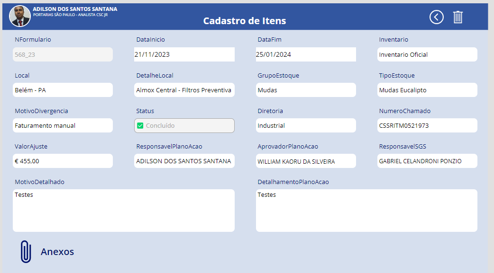

<!-- 
  -->
   

# PowerApps - Aplicativo Aplicativo Plano de Ação 

## ⚠️ Visão Geral

O aplicativo Plano de Ação foi desenvolvido visando proporcionar uma gestão eficiente e simplificada do processo de planejamento e execução de ações, promovendo uma integração amigável entre a área inventariada. Este documento destaca os pontos positivos e os ganhos que o aplicativo oferece.

## ⚠️ Aviso DEV
Para usar este modelo no seu projeto é necessário uma conexão com banco de dados que foi removida do mesmo por motivos de segurança.
Este app esta em uso pelo time do Inventário SGS por uma empresa da area de logistica.

## 📶 Funcionalidades Principais

- **Responsividade:** O aplicativo é projetado para funcionar de forma eficiente em vários dispositivos, incluindo smartphones, tablets e desktops.

- **Navegação Simplificada:** O aplicativo oferece uma navegação fluida, facilitando o acesso e a utilização por parte dos usuários, mesmo aqueles que possuem pouca experiência em ferramentas de gestão.

- **Geração de Dashboard:** O Plano de Ação possibilita a geração de Dashboards personalizáveis, permitindo uma visão gerencial abrangente das ações em andamento e concluídas.

- **Monitoramento em Tempo Real:** Os Dashboards oferecem informações em tempo real, fornecendo uma visão holística do status do plano de ação e auxiliando na tomada de decisões baseada em dados.

- **Acesso Gratuito:** O aplicativo é disponibilizado sem custos adicionais, eliminando a necessidade de investimentos financeiros na aquisição da ferramenta.

- **Economia de Recursos:** Ao optar por uma solução de plano de ação sem custos, a empresa beneficia-se de uma significativa economia de recursos, direcionando-os para outras áreas estratégicas.

- **Criptografia Avançada:** O Plano de Ação utiliza protocolos de segurança avançados, garantindo a proteção dos dados sensíveis armazenados na plataforma.

- **Acesso Controlado:** Mecanismos de controle de acesso são implementados para assegurar que apenas usuários autorizados tenham acesso às informações relevantes, garantindo a confidencialidade dos dados.

## 🤖 Atendimento Completo ao Fluxo de Plano de Ação:

- **Etapas Abrangentes:** O aplicativo abrange todas as etapas do fluxo de plano de ação, desde a identificação e elaboração até a execução e monitoramento, proporcionando uma solução completa e integrada.

- **Customização de Processos:** É possível customizar o fluxo de trabalho de acordo com as necessidades específicas da empresa, garantindo flexibilidade e adequação aos diferentes contextos.

- **Implementação Rápida:** O Plano de Ação reduz significativamente o tempo necessário para implementação, permitindo que a empresa alcance o Go Live de forma mais eficiente.

- **Treinamento Simplificado:** A interface amigável contribui para uma curva de aprendizado mais rápida, acelerando a adoção por parte dos usuários.

- **Atualizações Automáticas:** O aplicativo é projetado com atualizações automáticas, minimizando a necessidade de intervenção constante da equipe SGS para manutenção.

- **Suporte Técnico Eficiente:** Em caso de necessidade, a equipe de suporte técnico está pronta para fornecer assistência rápida e eficaz, reduzindo o tempo dedicado à manutenção. 

## 🧑🏼‍💻 Como Usar:

1. **Acesso:**
   - Faça login usando as credenciais fornecidas pela equipe de TI.

2. **Leitura de Código de Barras:**
   - Utilize a função de leitura de código de barras para escanear os códigos dos produtos recebidos.

3. **Registro de Avarias ou Não Conformidades:**
   - Preencha os campos necessários para documentar avarias ou não conformidades.
   - Anexe fotos, se necessário, para fornecer uma documentação visual.

4. **Responsividade:**
   - Aproveite a experiência responsiva em diferentes dispositivos para maior flexibilidade no uso.

## ⚙️ Requisitos do Sistema: 

- Navegador da web moderno
- Dispositivo com câmera para a funcionalidade de leitura de código de barras (em dispositivos móveis)

##  💻 Capturas de Tela 

### Tablet (Modo Paisagem)

### Tablet (Modo Paisagem_Tela Edição)

### Celular e Tablet (Modo Retrato)

Este documento destaca os benefícios e a usabilidade do aplicativo Plano de Ação, enfatizando como a ferramenta contribui para uma gestão eficiente e integrada do processo de planejamento e execução de ações. Ao adotar essa solução, a empresa pode desfrutar de uma abordagem inovadora e otimizada para atender às demandas do seu plano de ação. 

## Autor

Adilson dos santos santana